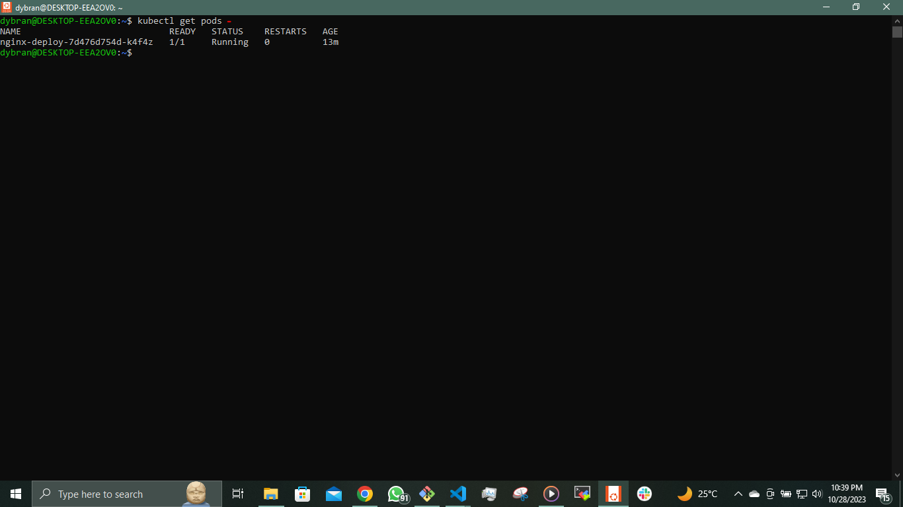
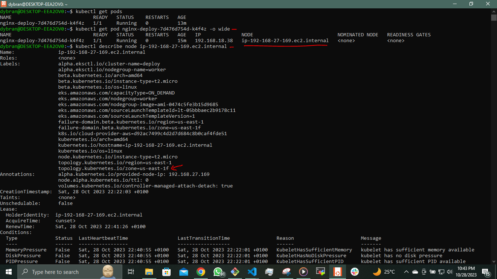
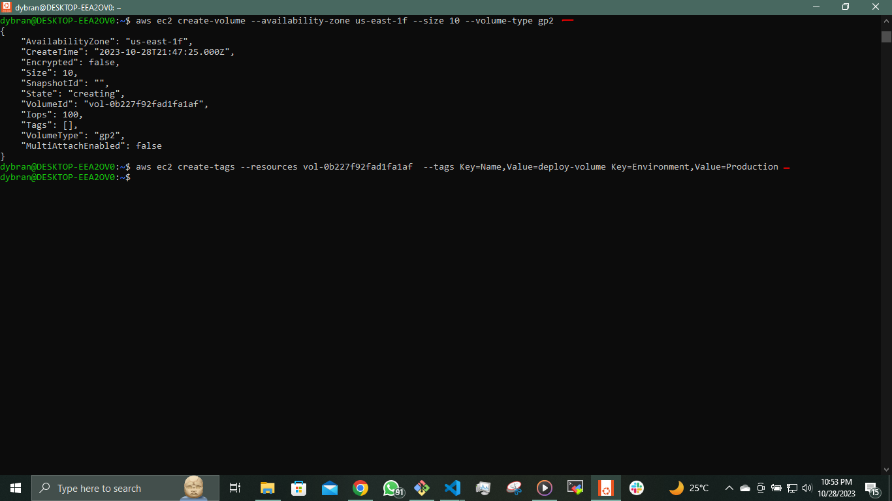
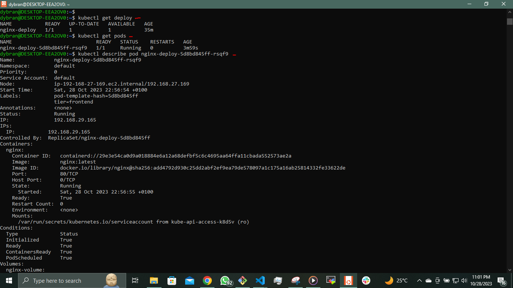
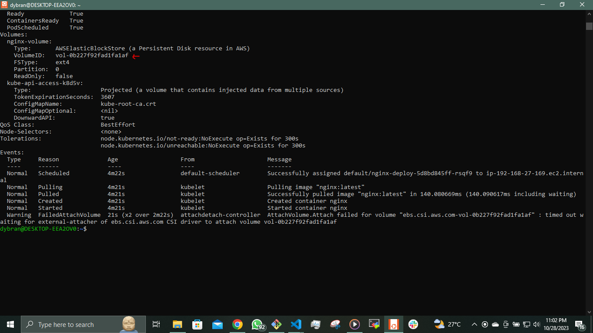
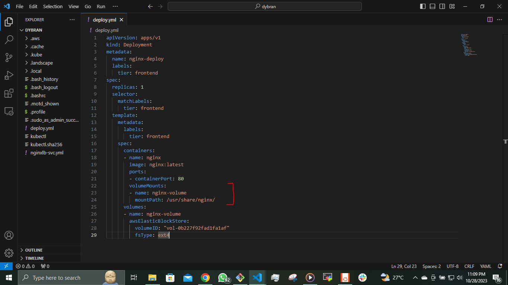

## PERSISTING DATA IN KUBERNETES

Now, it is important to understand that containers in Kubernetes are designed to be stateless. This means that data doesn't persist within the containers. Even when you deploy containers within Kubernetes pods, they maintain their statelessness unless you specifically configure your environment to support statefulness.


Create a deployment __deploy.yml__

```
apiVersion: apps/v1
kind: Deployment
metadata:
  name: nginx-deploy
  labels:
    tier: frontend
spec:
  replicas: 1
  selector:
    matchLabels:
      tier: frontend
  template:
    metadata:
      labels:
        tier: frontend
    spec:
      containers:
      - name: nginx
        image: nginx:latest
        ports:
        - containerPort: 80
```
`$ kubectl apply -f nginx-deploy.yml`

Verify the pods are running

`$ kubectl get pods`




To introduce statefulness in Kubernetes, you need to grasp the workings of __volumes__, __persistent volumes__ and __persistent volume claims__.

__Volumes__

Files stored on the disk within a container are temporary, posing challenges for complex applications running within containers. One issue is the potential loss of files when a container crashes. The __kubelet__ responsible for managing containers, restarts the container but it starts with a clean slate. Another issue arises when multiple containers within the same pod need to share files. The Kubernetes volume abstraction effectively addresses both of these problems.

Docker also incorporates the concept of volumes, though it is somewhat less structured and managed. In Docker, a volume can be a directory on the disk or within another container. Docker offers volume drivers but their functionality is limited.

Kubernetes, on the other hand, supports a wide range of volume types. Within a pod, you can utilize various volume types simultaneously. Ephemeral volume types have a lifespan tied to the pod's existence, while persistent volumes persist even after a pod terminates. When a pod is no longer needed, Kubernetes removes ephemeral volumes but it retains persistent volumes. This means that, regardless of the volume type, data remains intact even when containers are restarted.

At its core, a volume is a directory, potentially containing data, that is accessible to the containers within a pod. The creation, underlying medium, and content of this directory depend on the specific volume type used. As a result, it's crucial to have a good understanding of the various volume types available in Kubernetes so that you can select the most suitable one for your particular use case.

__awsElasticBlockStore__

An __awsElasticBlockStore volume__ mounts an Amazon Web Services (AWS) EBS volume into your pod. The contents of an EBS volume are persisted and the volume is only unmmounted when the pod crashes or terminates. This means that an EBS volume can be pre-populated with data, and that data can be shared between pods.

To see how stateless volume works, see [Project-22](https://github.com/dybran/Project-22/blob/main/Project-22.md).

__NOTE:__ There are some restrictions when using an awsElasticBlockStore volume:

- The nodes on which pods are running must be AWS EC2 instances
- Those instances need to be in the same region and availability zone as the EBS volume
- EBS only supports a single EC2 instance mounting a volume.

Now that we have the pod running without a volume.

lets create a volume using either AWS Console or __aws ec2 create-volume__.

Before the volume is created, we need to ensure that the volume exists in the same region and availability zone as the EC2 instance running the pod.

`$ kubectl get pod nginx-deploy-7d476d754d-k4f4z`

Describe the node to get the availability zone

`$ kubectl describe node ip-192-168-27-169.ec2.internal`



we know the AZ for the node is in __us-east-1f__. The volume must be created in the same AZ. Choose the size of the required volume.

Create the EBS Volume

`$ aws ec2 create-volume --availability-zone us-east-1f --size 10 --volume-type gp2`

#####

Tag the volume

`$ aws ec2 create-tags --resources vol-0b227f92fad1fa1af  --tags Key=Name,Value=deploy-volume Key=Environment,Value=Production`




Update the __deploy.yml__ configuration with the volume specificaation.

```
apiVersion: apps/v1
kind: Deployment
metadata:
  name: nginx-deploy
  labels:
    tier: frontend
spec:
  replicas: 1
  selector:
    matchLabels:
      tier: frontend
  template:
    metadata:
      labels:
        tier: frontend
    spec:
      containers:
      - name: nginx
        image: nginx:latest
        ports:
        - containerPort: 80
      volumes:
      - name: nginx-volume
        awsElasticBlockStore:
          volumeID: "vol-0b227f92fad1fa1af"
          fsType: ext4
```
The volume section indicates the type of volume to be used to ensure persistence.

Apply the new configuration

`$ kubectl apply -f deploy.yml`

Now, the new pod has a volume attached to it and can be used to run a container for statefuleness.

To verify run

`$ kubectl get deploy`

`$ kubectl get pods`

`$ kubectl describe pods nginx-deploy-5d8bd845ff-rsqf9`




At this stage, although the pod can accommodate a stateful application, the configuration remains unfinished. This is due to the fact that the volume has not yet been attached to any specific file system within the container. The directory __/usr/share/nginx/html__, which houses the software or website code remains ephemeral, and any modifications to the __index.html__ file will only persist as long as the pod is active. If the pod terminates, all previously written data will be lost.

To finalize the configuration, an additional section must be added to the deployment YAML manifest. The "volumeMounts" section essentially addresses the question, "Where should this volume be mounted inside the container?" Mounting a volume to a directory ensures that all data written to that directory will be stored on the specified volume.

```
apiVersion: apps/v1
kind: Deployment
metadata:
  name: nginx-deploy
  labels:
    tier: frontend
spec:
  replicas: 1
  selector:
    matchLabels:
      tier: frontend
  template:
    metadata:
      labels:
        tier: frontend
    spec:
      containers:
      - name: nginx
        image: nginx:latest
        ports:
        - containerPort: 80
        volumeMounts:
        - name: nginx-volume
          mountPath: /usr/share/nginx/
      volumes:
      - name: nginx-volume
        # This AWS EBS volume must already exist.
        awsElasticBlockStore:
          volumeID: "vol-0b227f92fad1fa1af"
          fsType: ext4
```


Notice the newly added section in the above.

The name you specify in the __volumeMounts__ section must match the name used in the __volumes__ section. This ensures that the volume is correctly mounted at the specified mount path. While data persistence solves some problems, it introduces new challenges.

Creating a volume currently involves a manual procedure that requires ensuring the volume is in the same Availability Zone as the running pod, followed by an update to the manifest file to include the volume ID. This approach contradicts DevOps principles, introducing unnecessary hurdles for straightforward tasks.

A more refined approach to address this challenge is to leverage __Persistent Volumes__ and __Persistent Volume Claims (PVCs)__.

Within Kubernetes, there exist several elegant methods for data persistence, each tailored to specific use cases.

- __Persistent Volume (PV) and Persistent Volume Claim (PVC):__ This pair of resources facilitates the effective management of storage. Persistent Volumes are cluster-wide storage resources, while Persistent Volume Claims act as requests for those resources. This dynamic duo allows for a more automated and scalable approach to handling storage.

- __configMap:__ While not directly related to data persistence, ConfigMaps in Kubernetes serve as a means to store configuration data in key-value pairs. They are an essential tool for managing application settings and configuration in a more organized manner.

__MANAGING VOLUMES DYNAMICALLY WITH PVS AND PVCS__

Kubernetes simplifies storage management by providing API objects that abstract the complexities of tasks such as volume provisioning, storage allocation, and access management. Users need only define manifest files to specify their desired actions.

Persistent Volumes (PVs) are storage plugins with an independent lifecycle, separate from the Pods that utilize them. This resilience ensures that even if a Pod terminates, the PV persists. A PV can be manually provisioned through an administrator's manifest file or dynamically generated if a predefined storage class is available.

Creating a PV manually resembles traditional volume creation through a console. However, the preferred approach is to automate PV creation by adding it to the container specification within deployments. Note that PVs cannot be automatically generated in the absence of a configured storage class in the cluster.

For storage systems like NFS, iSCSI, or cloud provider-specific solutions such as AWS's EBS, PVs can be dynamically generated to create volumes for Pods. This requires the presence of a storage class resource within the cluster for PV provisioning.

In Amazon EKS (Elastic Kubernetes Service), a default storage class is pre-configured during installation. This default storage class, based on the gp2 type, utilizes Amazon's solid-state drives (SSDs), making it suitable for a wide range of transactional workloads.


