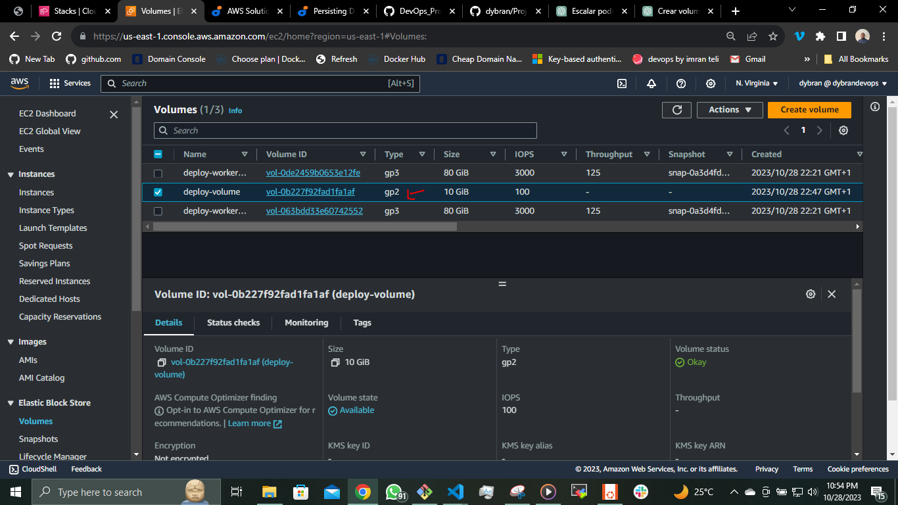

## PERSISTING DATA IN KUBERNETES

Now, it is important to understand that containers in Kubernetes are designed to be stateless. This means that data doesn't persist within the containers. Even when you deploy containers within Kubernetes pods, they maintain their statelessness unless you specifically configure your environment to support statefulness.

Create a cluster on EKS

```
eksctl create cluster \
  --name deploy \
  --region us-east-1 \
  --nodegroup-name worker \
  --node-type t2.micro \
  --nodes 2
```
Create a deployment __deploy.yml__

```
apiVersion: apps/v1
kind: Deployment
metadata:
  name: nginx-deploy
  labels:
    tier: frontend
spec:
  replicas: 1
  selector:
    matchLabels:
      tier: frontend
  template:
    metadata:
      labels:
        tier: frontend
    spec:
      containers:
      - name: nginx
        image: nginx:latest
        ports:
        - containerPort: 80
```
`$ kubectl apply -f nginx-deploy.yml`

Verify the pod is running

`$ kubectl get pods`


To introduce statefulness in Kubernetes, you need to grasp the workings of __volumes__, __persistent volumes__ and __persistent volume claims__.

__Volumes__

Files stored on the disk within a container are temporary, posing challenges for complex applications running within containers. One issue is the potential loss of files when a container crashes. The __kubelet__ responsible for managing containers, restarts the container but it starts with a clean slate. Another issue arises when multiple containers within the same pod need to share files. The Kubernetes volume abstraction effectively addresses both of these problems.

Docker also incorporates the concept of volumes, though it is somewhat less structured and managed. In Docker, a volume can be a directory on the disk or within another container. Docker offers volume drivers but their functionality is limited.

Kubernetes, on the other hand, supports a wide range of volume types. Within a pod, you can utilize various volume types simultaneously. Ephemeral volume types have a lifespan tied to the pod's existence, while persistent volumes persist even after a pod terminates. When a pod is no longer needed, Kubernetes removes ephemeral volumes but it retains persistent volumes. This means that, regardless of the volume type, data remains intact even when containers are restarted.

At its core, a volume is a directory, potentially containing data, that is accessible to the containers within a pod. The creation, underlying medium, and content of this directory depend on the specific volume type used. As a result, it's crucial to have a good understanding of the various volume types available in Kubernetes so that you can select the most suitable one for your particular use case.

__awsElasticBlockStore__

An __awsElasticBlockStore volume__ mounts an Amazon Web Services (AWS) EBS volume into your pod. The contents of an EBS volume are persisted and the volume is only unmmounted when the pod crashes or terminates. This means that an EBS volume can be pre-populated with data, and that data can be shared between pods.

To see how stateless volume works, see [Project-22](https://github.com/dybran/Project-22/blob/main/Project-22.md).

__NOTE:__ There are some restrictions when using an awsElasticBlockStore volume:

- The nodes on which pods are running must be AWS EC2 instances
- Those instances need to be in the same region and availability zone as the EBS volume
- EBS only supports a single EC2 instance mounting a volume.

Now that we have the pod running without a volume.

lets create a volume using either AWS Console or __aws ec2 create-volume__.

Before the volume is created, we need to ensure that the volume exists in the same region and availability zone as the EC2 instance running the pod.

`$ kubectl get pod nginx-deploy-7d476d754d-k4f4z`

Describe the node to get the availability zone

`$ kubectl describe node ip-192-168-27-169.ec2.internal`


we know the AZ for the node is in __us-east-1f__. The volume must be created in the same AZ. Choose the size of the required volume.

Create the EBS Volume

`$ aws ec2 create-volume --availability-zone us-east-1f --size 10 --volume-type gp2`

Tag the volume

`$ aws ec2 create-tags --resources vol-0b227f92fad1fa1af  --tags Key=Name,Value=deploy-volume Key=Environment,Value=Production`




Update the __deploy.yml__ configuration with the volume specificaation.

```
apiVersion: apps/v1
kind: Deployment
metadata:
  name: nginx-deploy
  labels:
    tier: frontend
spec:
  replicas: 1
  selector:
    matchLabels:
      tier: frontend
  template:
    metadata:
      labels:
        tier: frontend
    spec:
      containers:
      - name: nginx
        image: nginx:latest
        ports:
        - containerPort: 80
      volumes:
      - name: nginx-volume
        awsElasticBlockStore:
          volumeID: "vol-0b227f92fad1fa1af"
          fsType: ext4
```
The volume section indicates the type of volume to be used to ensure persistence.

Apply the new configuration

`$ kubectl apply -f deploy.yml`

Now, the new pod has a volume attached to it and can be used to run a container for statefuleness.

To verify run

`$ kubectl get deploy`

`$ kubectl get pods`

`$ kubectl describe pods nginx-deploy-5d8bd845ff-rsqf9`


At this stage, although the pod can accommodate a stateful application, the configuration remains unfinished. This is due to the fact that the volume has not yet been attached to any specific file system within the container. The directory __/usr/share/nginx/html__, which houses the software or website code remains ephemeral, and any modifications to the __index.html__ file will only persist as long as the pod is active. If the pod terminates, all previously written data will be lost.

To finalize the configuration, an additional section must be added to the deployment YAML manifest. The "volumeMounts" section essentially addresses the question, "Where should this volume be mounted inside the container?" Mounting a volume to a directory ensures that all data written to that directory will be stored on the specified volume.

```
apiVersion: apps/v1
kind: Deployment
metadata:
  name: nginx-deploy
  labels:
    tier: frontend
spec:
  replicas: 1
  selector:
    matchLabels:
      tier: frontend
  template:
    metadata:
      labels:
        tier: frontend
    spec:
      containers:
      - name: nginx
        image: nginx:latest
        ports:
        - containerPort: 80
        volumeMounts:
        - name: nginx-volume
          mountPath: /usr/share/nginx/
      volumes:
      - name: nginx-volume
        # This AWS EBS volume must already exist.
        awsElasticBlockStore:
          volumeID: "vol-0b227f92fad1fa1af"
          fsType: ext4
```


Notice the newly added section in the above.

The name you specify in the __volumeMounts__ section must match the name used in the __volumes__ section. This ensures that the volume is correctly mounted at the specified mount path. While data persistence solves some problems, it introduces new challenges.

Creating a volume currently involves a manual procedure that requires ensuring the volume is in the same Availability Zone as the running pod, followed by an update to the manifest file to include the volume ID. This approach contradicts DevOps principles, introducing unnecessary hurdles for straightforward tasks.

A more refined approach to address this challenge is to leverage __Persistent Volumes__ and __Persistent Volume Claims (PVCs)__.

Within Kubernetes, there exist several elegant methods for data persistence, each tailored to specific use cases.

- __Persistent Volume (PV) and Persistent Volume Claim (PVC):__ This pair of resources facilitates the effective management of storage. Persistent Volumes are cluster-wide storage resources, while Persistent Volume Claims act as requests for those resources. This dynamic duo allows for a more automated and scalable approach to handling storage.

- __configMap:__ While not directly related to data persistence, ConfigMaps in Kubernetes serve as a means to store configuration data in key-value pairs. They are an essential tool for managing application settings and configuration in a more organized manner.

__MANAGING VOLUMES DYNAMICALLY WITH PVS AND PVCS__

Kubernetes simplifies storage management by providing API objects that abstract the complexities of tasks such as volume provisioning, storage allocation, and access management. Users need only define manifest files to specify their desired actions.

Persistent Volumes (PVs) are storage plugins with an independent lifecycle, separate from the Pods that utilize them. This resilience ensures that even if a Pod terminates, the PV persists. A PV can be manually provisioned through an administrator's manifest file or dynamically generated if a predefined storage class is available.

Creating a PV manually resembles traditional volume creation through a console. However, the preferred approach is to automate PV creation by adding it to the container specification within deployments. Note that PVs cannot be automatically generated in the absence of a configured storage class in the cluster.

For storage systems like NFS, iSCSI, or cloud provider-specific solutions such as AWS's EBS, PVs can be dynamically generated to create volumes for Pods. This requires the presence of a storage class resource within the cluster for PV provisioning.

During the installation of Amazon EKS (Elastic Kubernetes Service), an out-of-the-box storage class is preconfigured. This default storage class utilizing Amazon's solid-state drives (SSDs) of the gp2 type, is designed to accommodate a diverse array of transactional workloads.

Run the command below to check if storageclass is present in the cluster 

`$ kubectl get storageclass`


If there is no storage class in your cluster, below manifest is an example of how one would be created

```
kind: StorageClass
apiVersion: storage.k8s.io/v1
metadata:
  name: gp2
  annotations:
    storageclass.kubernetes.io/is-default-class: "true"
provisioner: kubernetes.io/aws-ebs
parameters:
  type: gp2
  fsType: ext4
```
A __PersistentVolumeClaim (PVC)__, in contrast, serves as a demand for storage. Just as Pods utilize resources on a node, PVCs tap into the resources offered by Persistent Volumes (PVs). While Pods can make resource requests specifying CPU and memory requirements, Claims can request specific storage size and [__access modes__](https://kubernetes.io/docs/concepts/storage/persistent-volumes/#access-modes). These  [__access modes__](https://kubernetes.io/docs/concepts/storage/persistent-volumes/#access-modes) modes can be configured as
- ReadWriteOnce
- ReadOnlyMany
- ReadWriteMany
- ReadWriteOncePod as detailed in the [__AccessModes__](https://kubernetes.io/docs/concepts/storage/persistent-volumes/#access-modesspecification).

__Lifecycle of a PV and PVC__

Persistent Volumes (PVs) represent resources within a cluster, while Persistent Volume Claims (PVCs) serve as requests for these resources and also act as claims to those resources. The interplay between PVs and PVCs follows a specific lifecycle:

__Provisioning:__
- __Static/Manual Provisioning:__ Cluster administrators manually create PVs using a manifest file that contains all the storage details. PVs are not limited to specific namespaces; they are clusterwide resources and are available for use upon request. In contrast, PVCs are namespace-specific.
- __Dynamic Provisioning:__ When there is no PV that matches a PVC's request, a dynamic PV is created based on the available StorageClass. If no suitable StorageClass exists, the PVC's request for a PV will fail.

__Binding:__
- PVCs are exclusively bound to specific PVs in a one-to-one mapping. Claims will remain unbound until a matching volume becomes available. For example, if a cluster has 50Gi PVs and a PVC requests 100Gi, the PVC can only be bound once a 100Gi PV is added to the cluster.

__Using:__
- Pods use PVCs as volumes. The cluster identifies the bound volume associated with a claim and mounts it for the Pod. Users can specify the desired access mode when using their claim as a volume in a Pod. Once a user has a bound claim, they retain access to the corresponding PV for as long as they need it.

__Storage Object in Use Protection:__
- This feature ensures that PersistentVolumeClaims (PVCs) actively used by Pods and PersistentVolumes (PVs) bound to PVCs are not removed from the system to prevent data loss. If a PVC is in active use by a Pod, its deletion is postponed until it is no longer actively used. The same applies to PVs bound to PVCs; their removal is delayed until they are no longer bound.

__Reclaiming:__
- When a user is finished with their volume, they can delete the PVC objects from the API, allowing the resource to be reclaimed. The reclaim policy for a PersistentVolume dictates what happens to the volume after it is released from its claim. Options include:
- __Retain:__ The volume is manually reclaimed. After a PersistentVolumeClaim is deleted, the PersistentVolume is considered "released" but retains the previous claimant's data.
- __Delete:__ For volume plugins supporting the Delete reclaim policy, both the PersistentVolume object and the associated external storage asset are removed. Dynamically provisioned volumes inherit the reclaim policy of their StorageClass, typically defaulting to Delete.

__NOTES:__
- Expanding the size of PVCs is only possible if the storageClass is configured to allow expansion with the __allowVolumeExpansion__ field set to true in the manifest YAML file.
- PVs provisioned in a specific availability zone can only be used by pods running in that zone. Attempts to use the PV in a different AZ will result in pending state and a volume node affinity conflict message.
- PVs are clusterwide resources not limited to namespaces, while PVCs are namespace-scoped.

[Click here](https://kubernetes.io/docs/concepts/storage/persistent-volumes/#types-of-persistent-volumes) to see types of persistent volumes.

Now lets create some persistence for our nginx deployment. We will use 2 different approaches.

Approach 1

Create a manifest file for a PVC, and based on the gp2 storageClass a PV will be dynamically created

```
    apiVersion: v1
    kind: PersistentVolumeClaim
    metadata:
      name: nginx-volume-claim
    spec:
      accessModes:
      - ReadWriteOnce
      resources:
        requests:
          storage: 2Gi
      storageClassName: gp2
```

Create the manifest file

`$ kubectl apply -f pvc.yml`

`$ kubectl describe pvc nginx-volume-claim`


If you run `kubectl get pv` you will see that no PV is created yet. The__ waiting for first consumer to be created before binding__ is a configuration setting from the storageClass. See the __VolumeBindingMode__ section below.


To proceed, simply apply the new deployment configuration below.

Then configure the Pod spec to use the PVC

```
apiVersion: apps/v1
kind: Deployment
metadata:
  name: nginx-deploy
  labels:
    tier: frontend
spec:
  replicas: 1
  selector:
    matchLabels:
      tier: frontend
  template:
    metadata:
      labels:
        tier: frontend
    spec:
      containers:
      - name: nginx
        image: nginx:latest
        ports:
        - containerPort: 80
        volumeMounts:
        - name: nginx-volume-claim
          mountPath: "/tmp/dybran"
      volumes:
      - name: nginx-volume-claim
        persistentVolumeClaim:
          claimName: nginx-volume-claim
```


Notice that the volumes section nnow has a __persistentVolumeClaim__. With the new deployment manifest, the __/tmp/dybran__ directory will be persisted, and any data written in there will be sotred permanetly on the volume, which can be used by another Pod if the current one gets replaced.

Now lets check the dynamically created PV